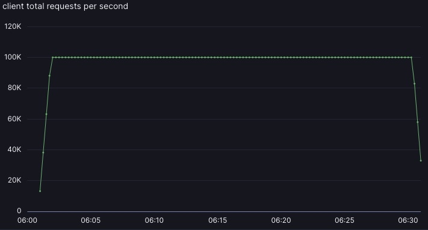
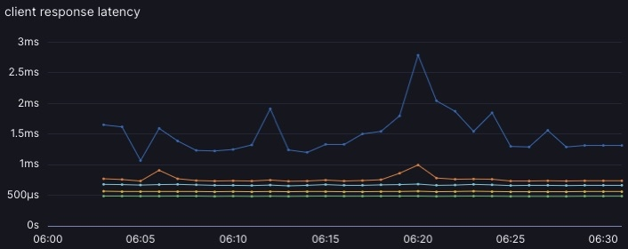

# protosocket
Message-oriented, low-abstraction tcp streams.

A protosocket is a non-blocking, bidirectional, message streaming connection.
Providing an encoder and decoder for your messages, you can stream to and from
tcp servers.

There is no wrapper encoding - no HTTP, no gRPC, no websockets. You depend on
TCP (and any wrapper you want, like TLS) and your serialization strategy.

Dependencies are trim; `tokio` is the main heavy dependency. If you use protocol
buffers, you will also depend on `prost`. There's no extra underlying framework
like `axum` or `hyper`.

Protosocket avoids opinions - you choose your own message ordering and concurrency
semantics. You can make an implicitly ordered stream, or a non-blocking out-of-order
stream, or RPC request/response, or whatever.

Tools to help working with protocol buffers are provided in [`protosocket-prost`](./protosocket-prost/).

You can write an RPC client/server with [`protosocket-rpc`](./protosocket-rpc/).

You can see an example of protocol buffers RPC in [`example-proto`](./example-proto/).

# Case study
## Background
(Full disclosure: I work at Momento at time of writing this): [Momento](https://www.gomomento.com/)
has historically been a gRPC company. In a particular backend service with a
fairly high message rate, the synchronization in `h2` under `tonic` was seen
to be blocking threads in the `tokio` request runtime too much. This was causing
task starvation and long polls.

The starvation was tough to see, but it happens with `lock_contended` stacks
underneath the `std::sync::Mutex` while trying to work with `h2` buffers. That
mutex is okay, but when the `futex` syscall parks a thread, it takes hundreds
of microseconds to get the thread going again on Momento's servers. It causes
extra latency that you can't easily measure, because tasks are also not picked
up promptly in these cases.

I was able to get 20% greater throughput by writing [k-lock](https://github.com/kvc0/k-lock)
and replacing the imports in `h2` for `std::sync::Mutex` with `k_lock::Mutex`.
This import-replacement for `std::sync::Mutex` tries to be more appropriate for
`tokio` servers. Basically, it uses a couple heuristics to both wake and spin
more aggressively than the standard mutex. This is better for `tokio` servers,
because those threads absolutely _must_ finish `poll()` asap, and a futex park
blows the poll() budget out the window.

20% wasn't enough, and the main task threads were still getting starved. So I
pulled `protosocket` out of [rmemstore](https://github.com/kvc0/rmemstore/),
to try it out on Momento's servers.

## Test setup
Momento has a daily latency and throughput test to monitor how changes are affecting
system performance. This test uses a small server setup to more easily stress
the service (as opposed to stressing the load generator).

Latency is measured outside of Momento, at the client. It includes a lot of factors
that are not directly under Momento control, and offers a full picture of how
the service could look to users (if it were deployed in a small setup like the
test).

The number Momento looked at historically was `at which throughput threshold does
the server pass 5 milliseconds at p99.9 tail latency?`

Achievable throughput increased, and latency at all throughputs was significantly
reduced. This improved the effective vertical scale of the reference workflow.

The effective vertical scale of the small reference server was improved by `2.75x`
for this workflow by switching the backend protocol from gRPC to protosocket.

## Continuing investment
As Momento leaned progressively into `protosocket`, the difference grew wider. The
`v1.0` effort on protosocket focused on removing abstractions and supporting more
extensibility in `&mut self` contexts. Other needs were found, like
[`spillway`](./spillway/), via flamegraphs.

Nowadays Momento is far past the previous gRPC benchmark. With protosocket `v1` and
further efforts, the old throughput/latency benchmark was too lax a standard. We now
do 100khz on the same server every morning and see sub-millisecond p99.9, and sub-3ms
p99.99, measured at the client. Performance per ec2 dollar, for small rpcs, is over
10 times better on protosocket v1 as compared to gRPC.

## Results
|                  | Throughput | Latency |
| -------------    | ---------  | --------- |
| **gRPC, optimized** |  |  |
| **protosocket v0, initial integration** |  |  |
| **protosocket v1, optimized** |  |  |
