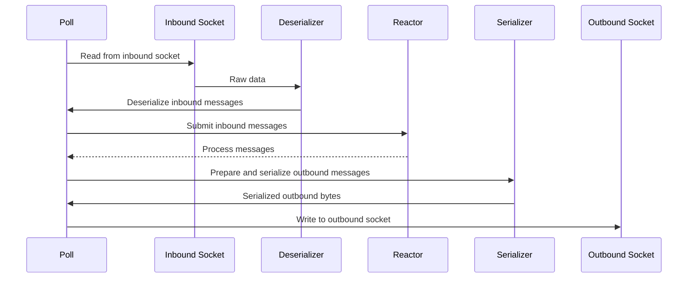

# protosocket-connection

`protosocket-connection` provides a flexible, asynchronous TCP connection handler. It's designed to efficiently manage bidirectional, message-oriented TCP streams with customizable serialization and deserialization.

## Key Features
- Low abstraction - no http or higher level constructs
- Asynchronous I/O using `mio` via `tokio`
- Customizable message types through `ConnectionBindings`
- Efficient buffer management and flexible error handling

## Flow Diagrams

The `poll()` function on `connection.rs` controls the lifecycle of the entire connection. You're recommended to read individual comments on the code to understand the flow, but below is a sequence diagram to get you started:

