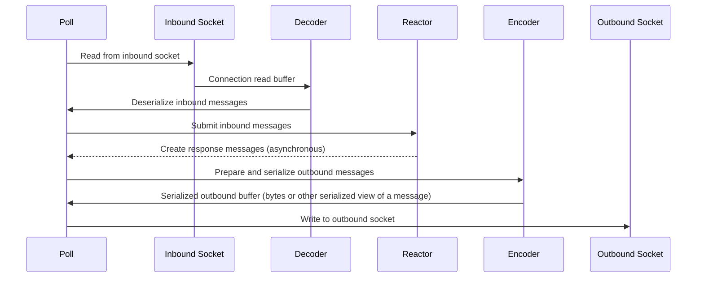

# protosocket

`protosocket` provides a flexible, asynchronous connection
handler. It's designed to efficiently manage bidirectional,
message-oriented streams with custom serialization and
deserialization.

## Key Features
- Low abstraction - no http or higher level constructs
- Asynchronous I/O using `mio` via `tokio`
- Flexible custom message types
- Efficient, flexible buffer management

## Flow Diagrams

The `poll()` function on `connection.rs` controls the lifecycle of the entire connection. You're recommended to read individual comments on the code to understand the flow, but below is a sequence diagram to get you started:

