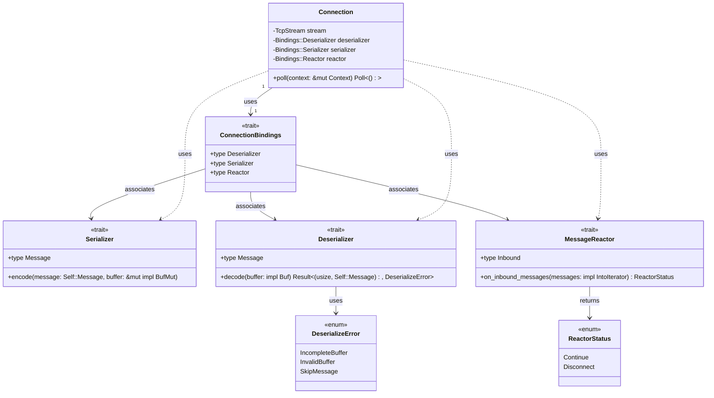
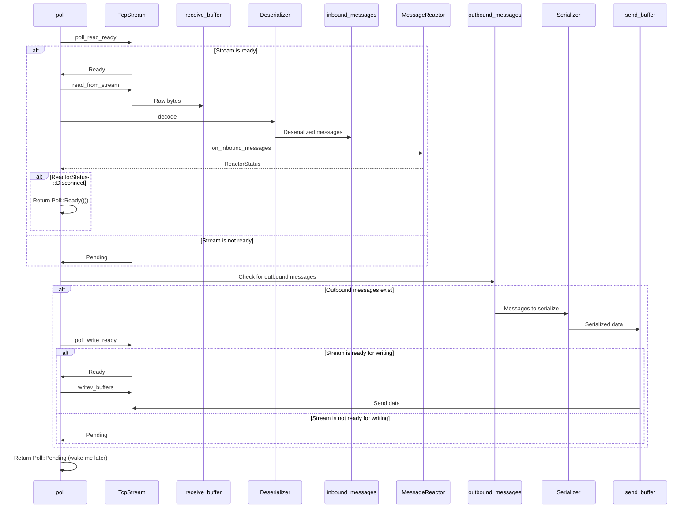

# protosocket-connection

`protosocket-connection` is a Rust library crate that provides a flexible, asynchronous TCP connection handler. It's designed to efficiently manage bidirectional, message-oriented TCP streams with customizable serialization and deserialization.

## Key Features
- Asynchronous I/O using Tokio
- Customizable message types through `ConnectionBindings`
- Efficient buffer management and flexible error handling

## Overview

The recommended order to read this library crate is

- `types.rs`
- `connection.rs`

### Flow Diagrams

This repository has the core components for a protosocket Connection. It encapsulates all the required types for the 
Connection within `ConnectionBindings` allowing you to dynamically provide the required `Message` type (like `String`) backing your connection. Below is a simple component diagram for the `Connection`:

The `poll()` function on `connection.rs` controls the lifecycle of the entire connection. You're recommended to read individual comments on the code to understand the flow, but below is a sequence diagram to get you started:

